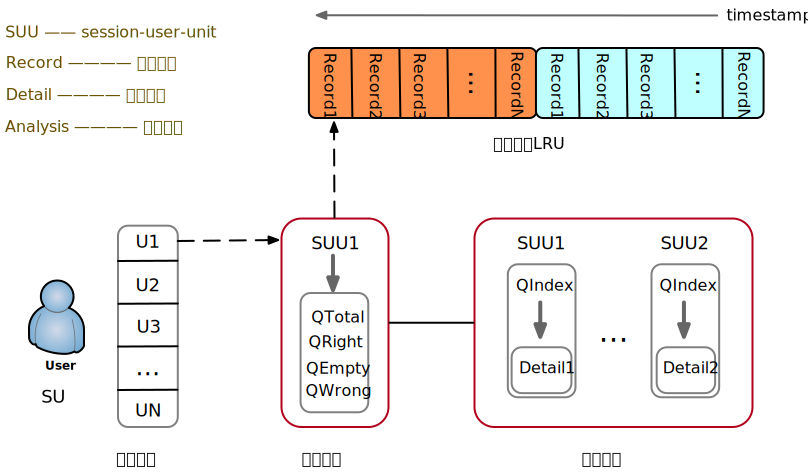

# 第x章  作答流程

## Entity

| `class`           | `filed` | `decribe` |
| ----------------- | ------- | --------- |
| `Session`         |         | 会话      |
| `SessionQuestion` |         | 抽题      |
| `AnswerRecord`    |         | 作答记录  |
| `AnswerDetail`    |         | 作答明细  |

## API

### session

| `return`    | `method`                                                     | `describe` |
| ----------- | ------------------------------------------------------------ | ---------- |
| `SessionV1` | `open(int applicationId, int stageId, String userIds, int rigid)` | 开启会话   |

### player

| `return`   | `method`                                                     | `describe` |
| ---------- | ------------------------------------------------------------ | ---------- |
| `AnswerV1` | `singleAnswer(int applicationId, long userId, long sessionId, int index, String itemIds, int cost)` | 单题作答   |

### fetch

| `return`                | `method`                                                  | `describe`   |
| ----------------------- | --------------------------------------------------------- | ------------ |
| `List<QuestionStashV1>` | `restore(int applicationId, long sessionId, long userId)` | 恢复作答现场 |

## High-Level Design

#### assume

- 作答流程的粒度是`user-session-unit`
- 抽题的粒度是`session-unit`

