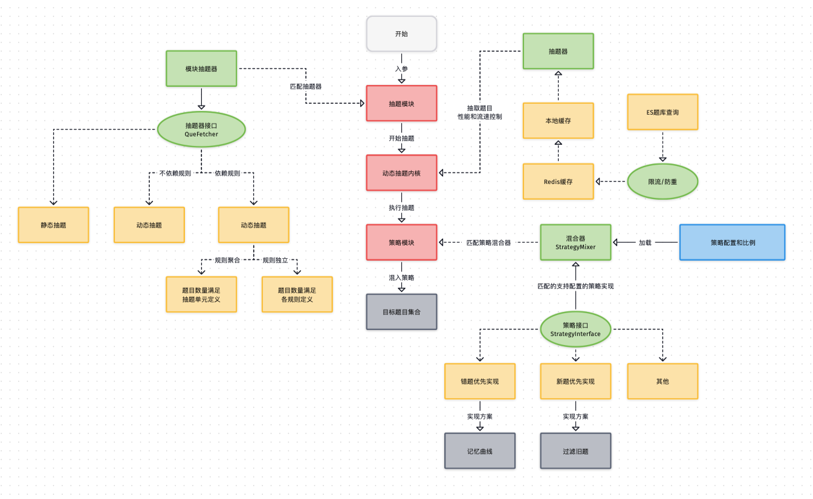
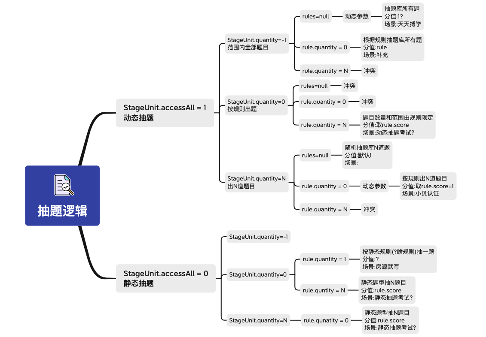
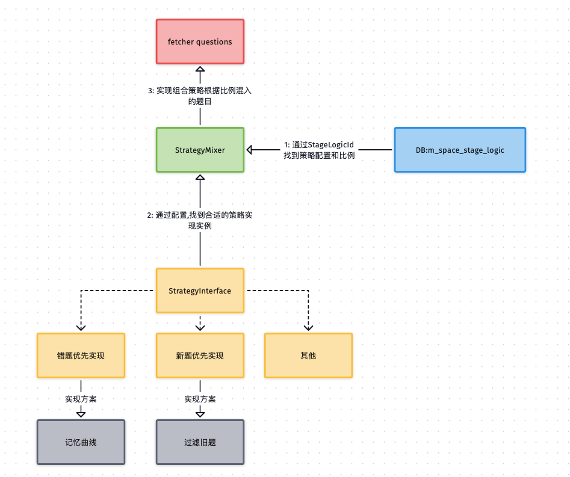

## 抽题逻辑全景图

## 抽题单元

抽题逻辑标识抽题单元和抽题规则组合,适用于于不同的答题场景.

### 抽题策略

**策略题目比例:**

策略配置位于数据库表`m_space_stage_logic`.策略组合,原则上各个策略比例之和不大于100%.

当比例高于100%且题目数量充足,根据策略优先级进行取舍,低优先级的降低比例,至满足条件为止.当前优先级为`错题优先`>`新题优先`.

当题目数量不足(包括比例高于100%的情况),则保留所有题目,剩余题目随机补充.

